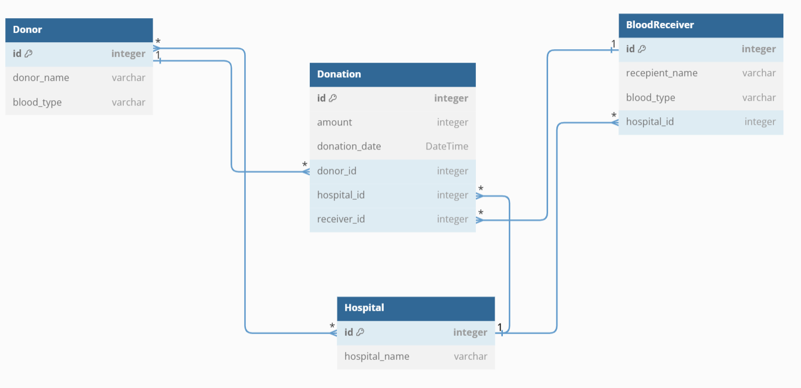

# BloodHub
BloodHub is a database schema designed to manage information related to blood donation, donors, hospitals, and blood recipients. The system facilitates the tracking of blood donations, including details about donors, donation amounts, donation dates, hospitals, and blood recipients.

## Setup
1. Clone the repository.
2. Install dependencies and enter the virtual environment:
    ```
    pipenv install && pipenv shell
    ```
3. Initialize migrations
    ```
    alembic init migrations
    ```
4. Edit `alembic.ini` file
    ```
    sqlalchemy.url = your_db_connection_string

    ```
5. Edit `env.py` to import Base and set target_metadata

6. Create and upgrade models using:
    ```
    alembic revision --autogenerate -m "message"
    alembic upgrade head
    ```

## Technologies used
- Python
- SQLAlchemy
- Alembic
- Faker

## Relational Diagram


## Collaborate
Feel free to contribute by opening issues or pull requests.

## License.
This project is licensed under the terms of the MIT license. See the [License](./LICENSE) file for details.
